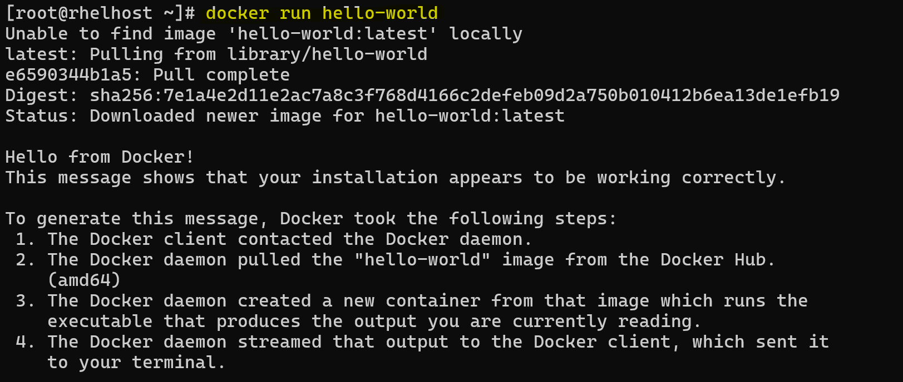
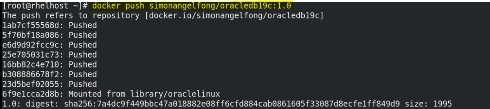
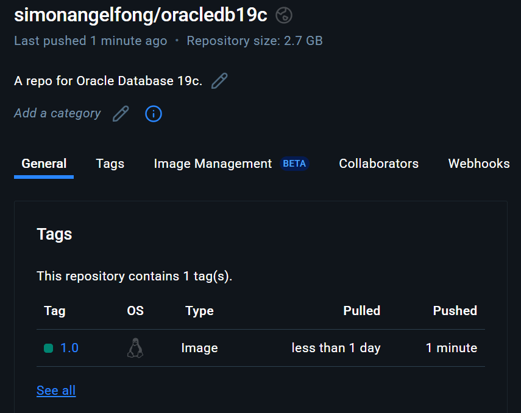
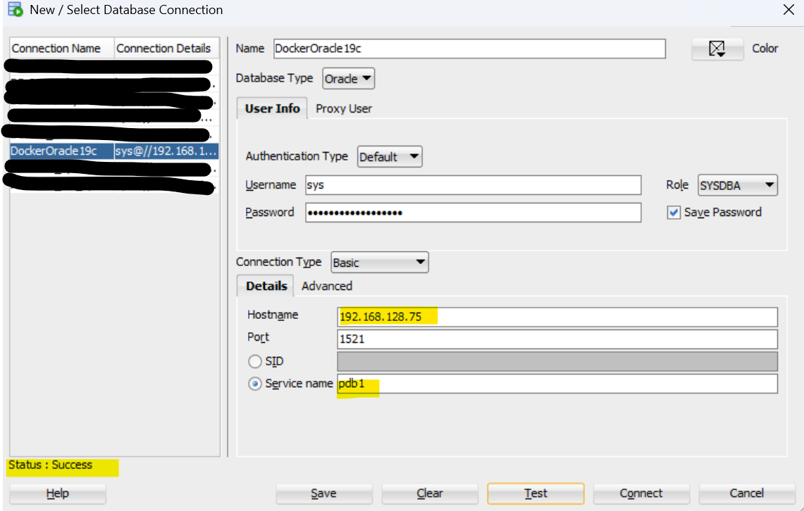

# Oracle Database 19c Dockerization

[Back](../../README.md)

- [Oracle Database 19c Dockerization](#oracle-database-19c-dockerization)
  - [Prerequisite](#prerequisite)
  - [Install Docker package](#install-docker-package)
  - [Clone Oracle Official Git Project](#clone-oracle-official-git-project)
  - [Build docker image](#build-docker-image)
  - [Push to docker hub](#push-to-docker-hub)
  - [Run docker container](#run-docker-container)
  - [Connect to database](#connect-to-database)
  - [Remvoe container](#remvoe-container)

---

## Prerequisite

- A VM running RHEL 8.10
  - At least **20GB** free space
- Oracle Database 19c Binary

---

## Install Docker package

```sh
# Remove existing packages
sudo dnf remove -y docker \
    docker-client \
    docker-client-latest \
    docker-common \
    docker-latest \
    docker-latest-logrotate \
    docker-logrotate \
    docker-engine \
    podman \
    runc

sudo dnf -y install dnf-plugins-core
sudo dnf config-manager --add-repo https://download.docker.com/linux/rhel/docker-ce.repo

sudo dnf install -y docker-ce docker-ce-cli containerd.io docker-buildx-plugin docker-compose-plugin

# Start Docker Engine.
sudo systemctl enable --now docker
# Verify
sudo docker run hello-world
```



---

## Clone Oracle Official Git Project

- Install Git and Clone Oracle official git project

```sh
dnf install git

mkdir -pv /project/oracledb_docker

git clone https://github.com/oracle/docker-images.git /project/oracledb_docker
```

---

## Build docker image

- Copy binary

```sh
# Navigate to the path
cd /project/oracledb_docker/OracleDatabase/SingleInstance/dockerfiles

# copy binary zip file to the version folder
ll /project/oracledb_docker/OracleDatabase/SingleInstance/dockerfiles/19.3.0/LINUX.X64_193000_db_home.zip
```

- Build local image

```sh
# run build container script
/project/oracledb_docker/OracleDatabase/SingleInstance/dockerfiles/buildContainerImage.sh -v 19.3.0 -e -t oracledb:1.0
# -e: creates image based on 'Enterprise Edition'
# -t: image_name:tag for the generated docker image
# note: The container needs at least 18 GB

# confirm
docker images
# REPOSITORY   TAG       IMAGE ID       CREATED         SIZE
# oracledb     1.0       e17de7041761   2 minutes ago   6.54GB
```

---

## Push to docker hub

- Create a repo in docker hub
  - `docker push simonangelfong/oracledb19c:tagname`

```sh
# tag the image
docker tag oracledb:1.0 simonangelfong/oracledb19c:1.0

# confirm
docker images
# REPOSITORY                   TAG       IMAGE ID       CREATED         SIZE
# oracledb                     1.0       e17de7041761   5 minutes ago   6.54GB
# simonangelfong/oracledb19c   1.0       e17de7041761   5 minutes ago   6.54GB

# login
docker login

docker push simonangelfong/oracledb19c:1.0
```





---

## Run docker container

```sh
# run docker container
docker run -d -it --name con_oracle19c \
    -p 1521:1521 \
    -p 5500:5500 \
    -e ORACLE_PDB=pdb1 \
    -e ORACLE_PWD=SecurePassword1234 \
    -e ORACLE_SID=ORCLCDB \
    -v oracledata:/opt/oracle/oradata \
    simonangelfong/oracledb19c:1.0

# confirm
docker ps
# CONTAINER ID   IMAGE                            COMMAND                  CREATED         STATUS                            PORTS                                                                                      NAMES
# 9ab8771038e9   simonangelfong/oracledb19c:1.0   "/bin/bash -c 'exec …"   5 seconds ago   Up 4 seconds (health: starting)   0.0.0.0:1521->1521/tcp, [::]:1521->1521/tcp, 0.0.0.0:5500->5500/tcp, [::]:5500->5500/tcp   oracledbcon


```

- Confirm
  - Oracle database 19c setup usually takes some time.

```sh
# it takes some time
docker logs con_oracle19c
# ORACLE EDITION: ENTERPRISE

# LSNRCTL for Linux: Version 19.0.0.0.0 - Production on 29-MAR-2025 21:46:03

# Copyright (c) 1991, 2019, Oracle.  All rights reserved.

# Starting /opt/oracle/product/19c/dbhome_1/bin/tnslsnr: please wait...

# TNSLSNR for Linux: Version 19.0.0.0.0 - Production
# System parameter file is /opt/oracle/product/19c/dbhome_1/network/admin/listener.ora
# Log messages written to /opt/oracle/diag/tnslsnr/255d140bb949/listener/alert/log.xml
# Listening on: (DESCRIPTION=(ADDRESS=(PROTOCOL=ipc)(KEY=EXTPROC1)))
# Listening on: (DESCRIPTION=(ADDRESS=(PROTOCOL=tcp)(HOST=0.0.0.0)(PORT=1521)))

# Connecting to (DESCRIPTION=(ADDRESS=(PROTOCOL=IPC)(KEY=EXTPROC1)))
# STATUS of the LISTENER
# ------------------------
# Alias                     LISTENER
# Version                   TNSLSNR for Linux: Version 19.0.0.0.0 - Production
# Start Date                29-MAR-2025 21:46:03
# Uptime                    0 days 0 hr. 0 min. 0 sec
# Trace Level               off
# Security                  ON: Local OS Authentication
# SNMP                      OFF
# Listener Parameter File   /opt/oracle/product/19c/dbhome_1/network/admin/listener.ora
# Listener Log File         /opt/oracle/diag/tnslsnr/255d140bb949/listener/alert/log.xml
# Listening Endpoints Summary...
#   (DESCRIPTION=(ADDRESS=(PROTOCOL=ipc)(KEY=EXTPROC1)))
#   (DESCRIPTION=(ADDRESS=(PROTOCOL=tcp)(HOST=0.0.0.0)(PORT=1521)))
# The listener supports no services
# The command completed successfully
# Prepare for db operation
# 8% complete
# Copying database files
# 31% complete
# Creating and starting Oracle instance
# 32% complete
# 36% complete
# 40% complete
# 43% complete
# 46% complete
# Completing Database Creation
# 51% complete
# 54% complete
# Creating Pluggable Databases
# 58% complete
# 77% complete
# Executing Post Configuration Actions
# 100% complete
# Database creation complete. For details check the logfiles at:
#  /opt/oracle/cfgtoollogs/dbca/ORCLCDB.
# Database Information:
# Global Database Name:ORCLCDB
# System Identifier(SID):ORCLCDB
# Look at the log file "/opt/oracle/cfgtoollogs/dbca/ORCLCDB/ORCLCDB.log" for further details.

# SQL*Plus: Release 19.0.0.0.0 - Production on Sat Mar 29 21:57:39 2025
# Version 19.3.0.0.0

# Copyright (c) 1982, 2019, Oracle.  All rights reserved.


# Connected to:
# Oracle Database 19c Enterprise Edition Release 19.0.0.0.0 - Production
# Version 19.3.0.0.0

# SQL>
# System altered.

# SQL>
# System altered.

# SQL>
# Pluggable database altered.

# SQL>
# PL/SQL procedure successfully completed.

# SQL> SQL>
# Session altered.

# SQL>
# User created.

# SQL>
# Grant succeeded.

# SQL>
# Grant succeeded.

# SQL>
# Grant succeeded.

# SQL>
# User altered.

# SQL> SQL> Disconnected from Oracle Database 19c Enterprise Edition Release 19.0.0.0.0 - Production
# Version 19.3.0.0.0
# The Oracle base remains unchanged with value /opt/oracle
# The Oracle base remains unchanged with value /opt/oracle
# #########################
# DATABASE IS READY TO USE!
# #########################
# The following output is now a tail of the alert.log:
# PDB1(3):ALTER DATABASE DEFAULT TABLESPACE "USERS"
# PDB1(3):Completed: ALTER DATABASE DEFAULT TABLESPACE "USERS"
# 2025-03-29T21:57:39.272472+00:00
# ALTER SYSTEM SET control_files='/opt/oracle/oradata/ORCLCDB/control01.ctl' SCOPE=SPFILE;
# 2025-03-29T21:57:39.281554+00:00
# ALTER SYSTEM SET local_listener='' SCOPE=BOTH;
#    ALTER PLUGGABLE DATABASE PDB1 SAVE STATE
# Completed:    ALTER PLUGGABLE DATABASE PDB1 SAVE STATE

# XDB initialized.
```

---

## Connect to database

```sh
docker exec -it con_oracle19c sqlplus / as sysdba
show pdbs

#     CON_ID CON_NAME                       OPEN MODE  RESTRICTED
# ---------- ------------------------------ ---------- ----------
#          2 PDB$SEED                       READ ONLY  NO
#          3 PDB1                           READ WRITE NO

docker exec -it con_oracle19c lsnrctl status

# LSNRCTL for Linux: Version 19.0.0.0.0 - Production on 29-MAR-2025 22:00:37

# Copyright (c) 1991, 2019, Oracle.  All rights reserved.

# Connecting to (DESCRIPTION=(ADDRESS=(PROTOCOL=IPC)(KEY=EXTPROC1)))
# STATUS of the LISTENER
# ------------------------
# Alias                     LISTENER
# Version                   TNSLSNR for Linux: Version 19.0.0.0.0 - Production
# Start Date                29-MAR-2025 21:46:03
# Uptime                    0 days 0 hr. 14 min. 34 sec
# Trace Level               off
# Security                  ON: Local OS Authentication
# SNMP                      OFF
# Listener Parameter File   /opt/oracle/product/19c/dbhome_1/network/admin/listener.ora
# Listener Log File         /opt/oracle/diag/tnslsnr/255d140bb949/listener/alert/log.xml
# Listening Endpoints Summary...
#   (DESCRIPTION=(ADDRESS=(PROTOCOL=ipc)(KEY=EXTPROC1)))
#   (DESCRIPTION=(ADDRESS=(PROTOCOL=tcp)(HOST=0.0.0.0)(PORT=1521)))
#   (DESCRIPTION=(ADDRESS=(PROTOCOL=tcps)(HOST=255d140bb949)(PORT=5500))(Security=(my_wallet_directory=/opt/oracle/admin/ORCLCDB/xdb_wallet))(Presentation=HTTP)(Session=RAW))
# Services Summary...
# Service "318345d4c9721123e063020011ac433a" has 1 instance(s).
#   Instance "ORCLCDB", status READY, has 1 handler(s) for this service...
# Service "ORCLCDB" has 1 instance(s).
#   Instance "ORCLCDB", status READY, has 1 handler(s) for this service...
# Service "ORCLCDBXDB" has 1 instance(s).
#   Instance "ORCLCDB", status READY, has 1 handler(s) for this service...
# Service "pdb1" has 1 instance(s).
#   Instance "ORCLCDB", status READY, has 1 handler(s) for this service...
# The command completed successfully

# alter firewall
firewall-cmd --permanent --add-port=1521/tcp
firewall-cmd --permanent --add-port=5500/tcp
firewall-cmd --reload

firewall-cmd --list-ports
# 1521/tcp 5500/tcp


echo > $ORACLE_HOME/network/admin/listener.ora<<EOF
LISTENER =
(DESCRIPTION_LIST =
  (DESCRIPTION =
    (ADDRESS = (PROTOCOL = IPC)(KEY = EXTPROC1))
    (ADDRESS = (PROTOCOL = TCP)(HOST = 0.0.0.0)(PORT = 1521))
  )
)

DEDICATED_THROUGH_BROKER_LISTENER=ON
DIAG_ADR_ENABLED = off
EOF
```

- Connect with SQL Deverloper remotely (not on the same VM)



---

## Remvoe container

```sh
# remove container
docker rm -flv con_oracle19c
# con_oracle19c

# confirm
docker ps -a
# CONTAINER ID   IMAGE     COMMAND   CREATED   STATUS    PORTS     NAMES
```
