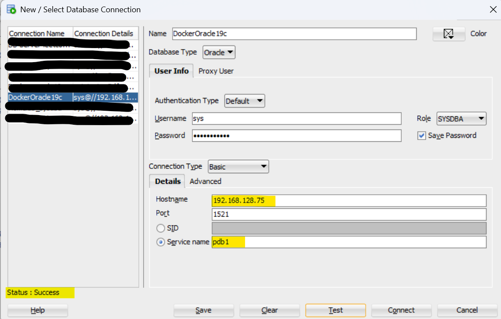

# Oracle Database 19c Docker Compose

[Back](../../README.md)

- [Oracle Database 19c Docker Compose](#oracle-database-19c-docker-compose)
  - [Prerequisite](#prerequisite)
  - [Create Script to Run](#create-script-to-run)
    - [Script to Run After Database Setup](#script-to-run-after-database-setup)
    - [Script to Run After Database Startup](#script-to-run-after-database-startup)
  - [Create Secret File](#create-secret-file)
  - [Create Compose YAML File](#create-compose-yaml-file)
  - [Run Docker Compose](#run-docker-compose)
  - [Connect to database](#connect-to-database)
  - [Remove Compose](#remove-compose)

---

## Prerequisite

- VM running RHEL 8.10
  - At least 8GB memory
  - At least 20GB free space
- Oracle Database 19c Image

---

## Create Script to Run

- Create dir for docker compose

```sh
mkdir -pv /project/docker-compose/setup
mkdir -pv /project/docker-compose/startup
```

- Rel:
  - https://github.com/oracle/docker-images/blob/main/OracleDatabase/SingleInstance/samples/customscripts/README.md

### Script to Run After Database Setup

```sh
cat > /project/docker-compose/setup/01custom_blocksize.sh<<EOE
#!/bin/sh
echo "Environment: $(uname -a)";
sysresv
sqlplus / "as sysdba" <<EOF
SET SERVEROUTPUT ON;
ALTER SYSTEM SET DB_32K_CACHE_SIZE = 256M SCOPE = SPFILE;

SHUTDOWN IMMEDIATE;
STARTUP;

SHOW PARAMETER db_32k_cache_size;
EOF
EOE

chmod +x /project/docker-compose/setup/01custom_blocksize.sh
```

---

### Script to Run After Database Startup

```sh
cat > /project/docker-compose/startup/01test.sql<<EOF
SHOW PDBS;
EOF

cat > /project/docker-compose/startup/02test.sql<<EOF
SHOW CON_NAME;
EOF
```

---

## Create Secret File

```sh
cat > /project/docker-compose/.env<<EOF
ORACLE_SID=ORCLCDB
ORACLE_PDB=pdb_name
ORACLE_PWD=your_pwd
EOF
```

---

## Create Compose YAML File

```yaml
services:
  oracle19c:
    image: simonangelfong/oracledb19c:1.0
    restart: always
    ports:
      - 1521:1521
      - 5500:5500
    env_file:
      - path: /project/docker-compose/.env
        required: true # default
    environment:
      - ORACLE_PDB=${ORACLE_PDB}
      - ORACLE_SID=${ORACLE_SID} # sid, otherwise cannot login as sysdba
      - ORACLE_PWD=${ORACLE_PWD} # Loaded from secret
    volumes:
      - oracledata:/opt/oracle/oradata # persist data
      - /project/docker-compose/setup:/opt/oracle/scripts/setup # script to run after setup
      - /project/docker-compose/startup:/opt/oracle/scripts/startup # script to run after startup
    healthcheck:
      test:
        [
          "CMD",
          "sqlplus",
          "-S",
          "sys/${ORACLE_PWD}@${ORACLE_SID}",
          "as",
          "sysdba",
          "<<<",
          "exit",
        ]
      interval: 30s
      timeout: 10s
      retries: 5
      start_period: 5m
    deploy:
      resources:
        limits:
          cpus: "2.0"
          memory: 8g
        reservations:
          memory: 4g
    networks:
      - oracle-net

volumes:
  oracledata:
networks:
  oracle-net:
    driver: bridge
```

---

## Run Docker Compose

- The setup script runs after setup and before startup.
- The startup script runs after Database opened.

```sh
docker compose -f /project/docker-compose/compose.yaml up --build -d
# [+] Running 3/3
#  ✔ Network docker-compose_oracle-net     Created                                             0.2s
#  ✔ Volume "docker-compose_oracledata"    Created                                             0.0s
#  ✔ Container docker-compose-oracle19c-1  Started                                             0.5s

# confirm
docker ps
# CONTAINER ID   IMAGE                            COMMAND                  CREATED          STATUS                    PORTS                                                                                      NAMES
# f0865f8bfe77   simonangelfong/oracledb19c:1.0   "/bin/bash -c 'exec …"   35 seconds ago   Up 35 seconds (healthy)   0.0.0.0:1521->1521/tcp, [::]:1521->1521/tcp, 0.0.0.0:5500->5500/tcp, [::]:5500->5500/tcp   docker-compose-oracle19c-1
```

- It taks some time
  - using log to confirm db created

```sh
# log
docker logs docker-compose-oracle19c-1
# 2025-03-29 19:12:42 ORACLE EDITION: ENTERPRISE
# 2025-03-29 19:12:42
# 2025-03-29 19:12:42 LSNRCTL for Linux: Version 19.0.0.0.0 - Production on 29-MAR-2025 23:12:42
# 2025-03-29 19:12:42
# 2025-03-29 19:12:42 Copyright (c) 1991, 2019, Oracle.  All rights reserved.
# 2025-03-29 19:12:42
# 2025-03-29 19:12:42 Starting /opt/oracle/product/19c/dbhome_1/bin/tnslsnr: please wait...
# 2025-03-29 19:12:42
# 2025-03-29 19:12:42 TNSLSNR for Linux: Version 19.0.0.0.0 - Production
# 2025-03-29 19:12:42 System parameter file is /opt/oracle/product/19c/dbhome_1/network/admin/listener.ora
# 2025-03-29 19:12:42 Log messages written to /opt/oracle/diag/tnslsnr/0a78fdedea05/listener/alert/log.xml
# 2025-03-29 19:12:42 Listening on: (DESCRIPTION=(ADDRESS=(PROTOCOL=ipc)(KEY=EXTPROC1)))
# 2025-03-29 19:12:42 Listening on: (DESCRIPTION=(ADDRESS=(PROTOCOL=tcp)(HOST=0.0.0.0)(PORT=1521)))
# 2025-03-29 19:12:42
# 2025-03-29 19:12:42 Connecting to (DESCRIPTION=(ADDRESS=(PROTOCOL=IPC)(KEY=EXTPROC1)))
# 2025-03-29 19:12:42 STATUS of the LISTENER
# 2025-03-29 19:12:42 ------------------------
# 2025-03-29 19:12:42 Alias                     LISTENER
# 2025-03-29 19:12:42 Version                   TNSLSNR for Linux: Version 19.0.0.0.0 - Production
# 2025-03-29 19:12:42 Start Date                29-MAR-2025 23:12:42
# 2025-03-29 19:12:42 Uptime                    0 days 0 hr. 0 min. 0 sec
# 2025-03-29 19:12:42 Trace Level               off
# 2025-03-29 19:12:42 Security                  ON: Local OS Authentication
# 2025-03-29 19:12:42 SNMP                      OFF
# 2025-03-29 19:12:42 Listener Parameter File   /opt/oracle/product/19c/dbhome_1/network/admin/listener.ora
# 2025-03-29 19:12:42 Listener Log File         /opt/oracle/diag/tnslsnr/0a78fdedea05/listener/alert/log.xml
# 2025-03-29 19:12:42 Listening Endpoints Summary...
# 2025-03-29 19:12:42   (DESCRIPTION=(ADDRESS=(PROTOCOL=ipc)(KEY=EXTPROC1)))
# 2025-03-29 19:12:42   (DESCRIPTION=(ADDRESS=(PROTOCOL=tcp)(HOST=0.0.0.0)(PORT=1521)))
# 2025-03-29 19:12:42 The listener supports no services
# 2025-03-29 19:12:42 The command completed successfully
# 2025-03-29 19:12:46 [WARNING] [DBT-11209] Current available memory is less than the required available memory (8,192MB) for creating the database.
# 2025-03-29 19:12:46    CAUSE: Following nodes do not have required available memory :
# 2025-03-29 19:12:46  Node:0a78fdedea05Available memory:6.4002GB (6711048.0KB)
# 2025-03-29 19:12:46
# 2025-03-29 19:12:47 Prepare for db operation
# 2025-03-29 19:12:47 8% complete
# 2025-03-29 19:12:47 Copying database files
# 2025-03-29 19:14:09 31% complete
# 2025-03-29 19:14:09 Creating and starting Oracle instance
# 2025-03-29 19:14:44 32% complete
# 2025-03-29 19:14:56 36% complete
# 2025-03-29 19:20:08 40% complete
# 2025-03-29 19:20:08 43% complete
# 2025-03-29 19:21:15 46% complete
# 2025-03-29 19:21:15 Completing Database Creation
# 2025-03-29 19:22:40 51% complete
# 2025-03-29 19:25:48 54% complete
# 2025-03-29 19:25:48 Creating Pluggable Databases
# 2025-03-29 19:26:01 58% complete
# 2025-03-29 19:26:01 77% complete
# 2025-03-29 19:26:01 Executing Post Configuration Actions
# 2025-03-29 19:26:01 100% complete
# 2025-03-29 19:26:01 Database creation complete. For details check the logfiles at:
# 2025-03-29 19:26:01  /opt/oracle/cfgtoollogs/dbca/ORCLCDB.
# 2025-03-29 19:26:01 Database Information:
# 2025-03-29 19:26:01 Global Database Name:ORCLCDB
# 2025-03-29 19:26:01 System Identifier(SID):ORCLCDB
# 2025-03-29 19:26:01 Look at the log file "/opt/oracle/cfgtoollogs/dbca/ORCLCDB/ORCLCDB.log" for further details.
# 2025-03-29 19:26:01
# 2025-03-29 19:26:01 SQL*Plus: Release 19.0.0.0.0 - Production on Sat Mar 29 23:26:01 2025
# 2025-03-29 19:26:01 Version 19.3.0.0.0
# 2025-03-29 19:26:01
# 2025-03-29 19:26:01 Copyright (c) 1982, 2019, Oracle.  All rights reserved.
# 2025-03-29 19:26:01
# 2025-03-29 19:26:01
# 2025-03-29 19:26:01 Connected to:
# 2025-03-29 19:26:01 Oracle Database 19c Enterprise Edition Release 19.0.0.0.0 - Production
# 2025-03-29 19:26:01 Version 19.3.0.0.0
# 2025-03-29 19:26:01
# 2025-03-29 19:26:01 SQL>
# 2025-03-29 19:26:01 System altered.
# 2025-03-29 19:26:01
# 2025-03-29 19:26:01 SQL>
# 2025-03-29 19:26:01 System altered.
# 2025-03-29 19:26:01
# 2025-03-29 19:26:01 SQL>
# 2025-03-29 19:26:01 Pluggable database altered.
# 2025-03-29 19:26:01
# 2025-03-29 19:26:01 SQL>
# 2025-03-29 19:26:01 PL/SQL procedure successfully completed.
# 2025-03-29 19:26:01
# 2025-03-29 19:26:01 SQL> SQL>
# 2025-03-29 19:26:01 Session altered.
# 2025-03-29 19:26:01
# 2025-03-29 19:26:01 SQL>
# 2025-03-29 19:26:01 User created.
# 2025-03-29 19:26:01
# 2025-03-29 19:26:01 SQL>
# 2025-03-29 19:26:01 Grant succeeded.
# 2025-03-29 19:26:01
# 2025-03-29 19:26:01 SQL>
# 2025-03-29 19:26:01 Grant succeeded.
# 2025-03-29 19:26:01
# 2025-03-29 19:26:01 SQL>
# 2025-03-29 19:26:01 Grant succeeded.
# 2025-03-29 19:26:01
# 2025-03-29 19:26:01 SQL>
# 2025-03-29 19:26:01 User altered.
# 2025-03-29 19:26:01
# 2025-03-29 19:26:01 SQL> SQL> Disconnected from Oracle Database 19c Enterprise Edition Release 19.0.0.0.0 - Production
# 2025-03-29 19:26:01 Version 19.3.0.0.0
# 2025-03-29 19:26:02 The Oracle base remains unchanged with value /opt/oracle
# 2025-03-29 19:26:04
# 2025-03-29 19:26:04 Executing user defined scripts
# 2025-03-29 19:26:04 /opt/oracle/runUserScripts.sh: running /opt/oracle/scripts/setup/01custom_blocksize.sh
# 2025-03-29 19:26:04 Environment: Linux 0a78fdedea05 5.15.153.1-microsoft-standard-WSL2 #1 SMP Fri Mar 29 23:14:13 UTC 2024 x86_64 x86_64 x86_64 GNU/Linux
# 2025-03-29 19:26:04
# 2025-03-29 19:26:04 IPC Resources for ORACLE_SID "ORCLCDB" :
# 2025-03-29 19:26:04 Maximum shared memory segment size (shmmax): 18446744073692774399 bytes
# 2025-03-29 19:26:04 Total system shared memory (shmall): 18446744004990070784 bytes
# 2025-03-29 19:26:04 Total system shared memory count (shmmni): 4096
# 2025-03-29 19:26:04 *********************** Dumping ipcs output ********************
# 2025-03-29 19:26:04
# 2025-03-29 19:26:04 ------ Message Queues --------
# 2025-03-29 19:26:04 key        msqid      owner      perms      used-bytes   messages
# 2025-03-29 19:26:04
# 2025-03-29 19:26:04 ------ Shared Memory Segments --------
# 2025-03-29 19:26:04 key        shmid      owner      perms      bytes      nattch     status
# 2025-03-29 19:26:04 0x00000000 16         oracle     600        9150464    157
# 2025-03-29 19:26:04 0x00000000 17         oracle     600        6425673728 79
# 2025-03-29 19:26:04 0x00000000 18         oracle     600        7626752    79
# 2025-03-29 19:26:04 0x43b375cc 19         oracle     600        36864      79
# 2025-03-29 19:26:04
# 2025-03-29 19:26:04 ------ Semaphore Arrays --------
# 2025-03-29 19:26:04 key        semid      owner      perms      nsems
# 2025-03-29 19:26:04 0x8d2a3534 19         oracle     600        304
# 2025-03-29 19:26:04
# 2025-03-29 19:26:04 *********************** End of ipcs command dump **************
# 2025-03-29 19:26:04
# 2025-03-29 19:26:04
# 2025-03-29 19:26:04 ***************** Dumping Resource Limits(s/h) *****************
# 2025-03-29 19:26:04 core file size                         0 KB/UNLIMITED
# 2025-03-29 19:26:04 data seg size                     UNLIMITED/UNLIMITED
# 2025-03-29 19:26:04 scheduling priority                    0 KB/0 KB
# 2025-03-29 19:26:04 file size                         UNLIMITED/UNLIMITED
# 2025-03-29 19:26:04 pending signals                       30 KB/30 KB
# 2025-03-29 19:26:04 max locked memory                 UNLIMITED/UNLIMITED
# 2025-03-29 19:26:04 max memory size                   UNLIMITED/UNLIMITED
# 2025-03-29 19:26:04 open files                          1024 KB/1024 KB
# 2025-03-29 19:26:04 POSIX message queues                 800 KB/800 KB
# 2025-03-29 19:26:04 real-time priority                     0 KB/0 KB
# 2025-03-29 19:26:04 stack size                            32 MB/UNLIMITED
# 2025-03-29 19:26:04 cpu time                          UNLIMITED/UNLIMITED
# 2025-03-29 19:26:04 max user processes                UNLIMITED/UNLIMITED
# 2025-03-29 19:26:04 virtual memory                    UNLIMITED/UNLIMITED
# 2025-03-29 19:26:04 file locks                        UNLIMITED/UNLIMITED
# 2025-03-29 19:26:04
# 2025-03-29 19:26:04 ***************** End of Resource Limits Dump ******************
# 2025-03-29 19:26:04 Maximum map count configured per process:  262144
# 2025-03-29 19:26:04 Total /dev/shm size: 46923776 bytes, used: 20185088 bytes
# 2025-03-29 19:26:04 Shared Memory:
# 2025-03-29 19:26:04 IDKEY
# 2025-03-29 19:26:04 17      0x00000000
# 2025-03-29 19:26:04 18      0x00000000
# 2025-03-29 19:26:04 16      0x00000000
# 2025-03-29 19:26:04 19      0x43b375cc
# 2025-03-29 19:26:04 Semaphores:
# 2025-03-29 19:26:04 IDKEY
# 2025-03-29 19:26:04 19      0x8d2a3534
# 2025-03-29 19:26:04 Oracle Instance alive for sid "ORCLCDB"
# 2025-03-29 19:26:04
# 2025-03-29 19:26:04 SQL*Plus: Release 19.0.0.0.0 - Production on Sat Mar 29 23:26:04 2025
# 2025-03-29 19:26:04 Version 19.3.0.0.0
# 2025-03-29 19:26:04
# 2025-03-29 19:26:04 Copyright (c) 1982, 2019, Oracle.  All rights reserved.
# 2025-03-29 19:26:04
# 2025-03-29 19:26:04
# 2025-03-29 19:26:04 Connected to:
# 2025-03-29 19:26:04 Oracle Database 19c Enterprise Edition Release 19.0.0.0.0 - Production
# 2025-03-29 19:26:04 Version 19.3.0.0.0
# 2025-03-29 19:26:04
# 2025-03-29 19:26:04 SQL> SQL>
# 2025-03-29 19:26:04 System altered.
# 2025-03-29 19:26:04
# 2025-03-29 19:26:45 SQL> SQL> Database closed.
# 2025-03-29 19:26:45 Database dismounted.
# 2025-03-29 19:26:58 ORACLE instance shut down.
# 2025-03-29 19:27:04 SQL> ORACLE instance started.
# 2025-03-29 19:27:04
# 2025-03-29 19:27:04 Total System Global Area 6442449672 bytes
# 2025-03-29 19:27:04 Fixed Size    9149192 bytes
# 2025-03-29 19:27:04 Variable Size 1140850688 bytes
# 2025-03-29 19:27:04 Database Buffers 5284823040 bytes
# 2025-03-29 19:27:04 Redo Buffers    7626752 bytes
# 2025-03-29 19:27:08 Database mounted.
# 2025-03-29 19:27:10 Database opened.
# 2025-03-29 19:27:10 SQL> SQL>
# 2025-03-29 19:27:10 NAME     TYPE VALUE
# 2025-03-29 19:27:10 ------------------------------------ ----------- ------------------------------
# 2025-03-29 19:27:10 db_32k_cache_size     big integer 256M
# 2025-03-29 19:27:10 SQL> Disconnected from Oracle Database 19c Enterprise Edition Release 19.0.0.0.0 - Production
# 2025-03-29 19:27:10 Version 19.3.0.0.0
# 2025-03-29 19:27:10
# 2025-03-29 19:27:10 DONE: Executing user defined scripts
# 2025-03-29 19:27:10
# 2025-03-29 19:27:10 The Oracle base remains unchanged with value /opt/oracle
# 2025-03-29 19:27:13 #########################
# 2025-03-29 19:27:13 DATABASE IS READY TO USE!
# 2025-03-29 19:27:13 #########################
# 2025-03-29 19:27:13
# 2025-03-29 19:27:13 Executing user defined scripts
# 2025-03-29 19:27:13 /opt/oracle/runUserScripts.sh: running /opt/oracle/scripts/startup/01test.sql
# 2025-03-29 19:27:13
# 2025-03-29 19:27:13     CON_ID CON_NAME  OPEN MODE  RESTRICTED
# 2025-03-29 19:27:13 ---------- ------------------------------ ---------- ----------
# 2025-03-29 19:27:13  2 PDB$SEED  READ ONLY  NO
# 2025-03-29 19:27:13  3 PDB1   READ WRITE NO
# 2025-03-29 19:27:14
# 2025-03-29 19:27:14
# 2025-03-29 19:27:14 /opt/oracle/runUserScripts.sh: running /opt/oracle/scripts/startup/02test.sql
# 2025-03-29 19:27:14
# 2025-03-29 19:27:14 CON_NAME
# 2025-03-29 19:27:14 ------------------------------
# 2025-03-29 19:27:14 CDB$ROOT
# 2025-03-29 19:27:15
# 2025-03-29 19:27:15
# 2025-03-29 19:27:15 DONE: Executing user defined scripts
# 2025-03-29 19:27:15
# 2025-03-29 19:27:15 The following output is now a tail of the alert.log:
# 2025-03-29 19:27:15 29170717,29173618,29181568,29182920,29183298,29186091,29191827,29201143,
# 2025-03-29 19:27:15 29201695,29209545,29210577,29210610,29210624,29210683,29213641,29219627,
# 2025-03-29 19:27:15 29224294,29225861,29229839,29235934,29242906,29243749,29244495,29244766,
# 2025-03-29 19:27:15 29244968,29248723,29249583,29251564,29255616,29260224,29261695,29271019,
# 2025-03-29 19:27:15 29273360,29282090,29282666,29285453,29285621,29290235,29292232,29293806,
# 2025-03-29 19:27:15 29294753,29299830,29307090,29307109,29311336,29329675,29330791,29339299,
# 2025-03-29 19:27:15 29357821,29360467,29360775,29367971,29368725,29379299,29379381,29380527,
# 2025-03-29 19:27:15 29381000,29382296,29391301,29393649,29402110,29411931,29413360,29457319,
# 2025-03-29 19:27:15 29465047
# 2025-03-29 19:27:15 ===========================================================

```

---

## Connect to database



---

## Remove Compose

```sh
docker compose -f /project/docker-compose/compose.yaml down -v --remove-orphans
# [+] Running 3/3
#  ✔ Container docker-compose-oracle19c-1  Removed                                            14.0s
#  ✔ Volume docker-compose_oracledata      Removed                                             0.5s
#  ✔ Network docker-compose_oracle-net     Removed                                             1.2s

# confirm
docker ps -a      # Check for remaining containers
docker network ls # Check for networks
docker volume ls  # Check for volumes
docker images     # Check for images

# If anything remains, you can remove them manually using:
docker network prune  # Remove unused networks
docker volume prune   # Remove unused volumes
docker image prune -a # Remove all unused images
```
